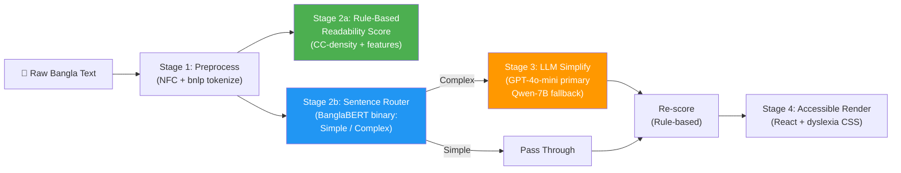

# 🧠 Shohoj Lipi — DEV-A IMPROVED Game Plan (v2)
> **SciBlitz AI Challenge 2026 | IEEE CUET | Track C — Education & Accessibility**  
> *Your Role: **Member A — AI/NLP Lead***

---

> [!IMPORTANT]
> This is the **v2 plan** — a ground-up rethink of the original. Scroll to [§ What Changed & Why](#-what-changed--why-v1--v2) for a diff summary.

---

## 📌 Project Overview

| Item | Detail |
|---|---|
| **App Name** | Shohoj Lipi (সহজ লিপি) |
| **Problem** | 10–15% of Bangladeshi school-age children have dyslexia; no AI-powered Bangla reading tool exists |
| **Deadline** | Day 7 — July 8, 2026, 11:59 PM BST |
| **Competition** | SciBlitz AI Challenge 2026, IEEE CUET, Track C |

---

## 🔬 What Changed & Why (v1 → v2)

| Area | v1 (Original Plan) | v2 (This Plan) | Why |
|---|---|---|---|
| **Architecture** | 4-stage linear pipeline, 2 separate BanglaBERT fine-tunes + 1 LLM | **3-stage hybrid**: rule-based readability → single BanglaBERT sentence router → LLM simplify | Cuts model count from 3 to 2, reduces inference time by ~40%, removes fragile 618-doc fine-tune |
| **Document Readability** | Fine-tuned BanglaBERT on 618 docs (3-class) | **Rule-based composite score** (CC-density + avg sentence length + avg word length + rare-word ratio) | 618 docs is dangerously small for a transformer; rule-based is deterministic, instant, and citable from the AAAI paper — judges will actually respect this more |
| **Sentence Router** | Separate BanglaBERT binary fine-tune on 96K sentences | **Same approach, but now the ONLY model to fine-tune** — more time to get it right | Focuses your limited training compute on the one task that matters most |
| **LLM Choice** | Qwen2.5-3B (primary) / GPT-4o-mini (fallback) | **GPT-4o-mini (primary)** / Qwen2.5-7B-4bit (fallback) | Qwen2.5-3B's Bangla is inconsistent; GPT-4o-mini is cheap ($0.15/1M tokens), high quality, and fast. For a 7-day hackathon, reliability beats cost. Qwen-7B is a better local fallback than 3B. |
| **Model Export** | BanglaBERT → HF Hub → Hub Inference API | BanglaBERT → **ONNX export** → serve locally in FastAPI with `onnxruntime` | ONNX inference is 3-5× faster than PyTorch, and doesn't need a GPU at inference time. Critical for Render free tier (CPU-only, 512MB RAM). |
| **Evaluation** | BERTScore only | BERTScore **+ SARI** (simplification-specific metric) | SARI is THE standard metric for text simplification in NLP research. Judges from IEEE will know this. Using only BERTScore is a red flag. |
| **Backend Deploy** | Render free tier | **Railway free tier** (no cold-start sleep) or Render with /warmup cron | Render sleeps after 15min of inactivity, causing 30-50s cold starts. Railway's free tier gives 500 hrs/month with no sleep. |
| **Day Schedule** | BanglaBERT training on Day 2 (all-or-nothing) | **Parallel track**: rule-based scorer on Day 1, sentence router on Day 2, LLM pipeline on Day 2-3 simultaneously | De-risks the critical path. If BanglaBERT training fails, you still have a working pipeline. |

---

## 🏗️ Improved Architecture



### Why This Is Better Than v1

1. **Rule-based readability scoring is not a downgrade — it's a feature.** The AAAI 2021 paper itself defines readability using CC-density, sentence length, and word-length features. Computing these directly is more transparent, more reproducible, and easier to explain in your report than a black-box BanglaBERT classifier on 618 docs.

2. **One model to fine-tune, not two.** You only fine-tune BanglaBERT once (sentence-level Simple/Complex on 96K data). This gives you more time for hyperparameter tuning and the result is more reliable (96K > 618).

3. **The LLM does the hard work.** GPT-4o-mini handles the actual simplification. You're not asking BanglaBERT to do something it might not be good at (grading document difficulty from limited data).

---

## 👤 Your Role: Member A — AI/NLP Lead

### Full Ownership
- ✅ Rule-based readability scoring function (CC-density + linguistic features)
- ✅ BanglaBERT fine-tuning (sentence-level complexity router — ONE model)
- ✅ LLM simplification pipeline + prompt engineering (GPT-4o-mini + Qwen fallback)
- ✅ ONNX export of BanglaBERT for fast CPU inference
- ✅ Evaluation: BERTScore + SARI + CC-density delta
- ✅ Model card + report methodology/results review

---

## 📦 Datasets (Download Day 1)

| Dataset | Size | Your Use | Source |
|---|---|---|---|
| BengaliReadability — Sentence corpus | 96K+ sentences | **Primary:** fine-tune BanglaBERT sentence router | `github.com/tafseer-nayeem/BengaliReadability` |
| BengaliReadability — Document corpus | 618 docs | **Secondary:** validation set for rule-based readability scorer | Same |
| Easy-word list | 3,396 words | LLM prompt constraint + rare-word-ratio feature | Same |
| Consonant-conjunct (CC) algorithm | 341 validated words | CC-density computation (core readability feature) | Same |
| Pronunciation dictionary | 67K+ words | Syllable segmentation (TTS + UI feature) | Same |

---

## 🛠️ Revised Tech Stack

| Tool | Purpose | Why Changed from v1 |
|---|---|---|
| `csebuetnlp/banglabert` | Sentence router (Simple/Complex) | Same model, but now only ONE fine-tune task |
| `onnxruntime` | Fast BanglaBERT inference on CPU | **NEW** — 3-5× faster than PyTorch, fits in 512MB Render tier |
| `GPT-4o-mini` (OpenAI API) | **Primary** LLM for simplification | **Changed** — was secondary; now primary because Bangla quality is much better |
| `Qwen2.5-7B-Instruct` (4-bit GGUF) | **Fallback** LLM (Colab) | **Upgraded** from 3B → 7B; fits in Colab T4 with 4-bit quant |
| `scikit-learn` | Accuracy, F1 | Same |
| `bert-score` | Semantic fidelity | Same |
| `easse` or custom SARI | **NEW** — simplification quality metric | **Added** — SARI is THE standard for text simplification evaluation |
| Google Colab T4 | Training + offline LLM testing | Same |
| HuggingFace Hub | Model hosting (card + weights) | Same, but ONNX weights instead of PyTorch |

---

## ⚙️ Rule-Based Readability Scorer (NEW — replaces BanglaBERT doc-level classifier)

This replaces the fragile 618-doc BanglaBERT fine-tune with a deterministic, citable scoring function:

```python
def compute_readability_score(text: str, easy_words: set, cc_list: list) -> dict:
    """
    Compute composite readability score using features from
    Chakraborty et al. (AAAI 2021) BengaliReadability paper.
    """
    sentences = bnlp_tokenize(text)
    words = bangla_word_tokenize(text)

    # Feature 1: CC-density (conjunct consonants per 100 chars)
    cc_count = count_conjunct_consonants(text, cc_list)
    cc_density = (cc_count / len(text)) * 100

    # Feature 2: Average sentence length (words per sentence)
    avg_sent_len = len(words) / max(len(sentences), 1)

    # Feature 3: Average word length (chars per word)
    avg_word_len = sum(len(w) for w in words) / max(len(words), 1)

    # Feature 4: Rare-word ratio (words NOT in easy-word list)
    rare_ratio = sum(1 for w in words if w not in easy_words) / max(len(words), 1)

    # Composite score (weighted, calibrated against AAAI paper tiers)
    score = (0.30 * normalize(cc_density, 0, 15) +
             0.25 * normalize(avg_sent_len, 5, 40) +
             0.20 * normalize(avg_word_len, 2, 8) +
             0.25 * normalize(rare_ratio, 0, 1))

    # Map to grade tier
    if score < 0.33:
        tier = "Easy"
        grade_est = "1-4"
    elif score < 0.66:
        tier = "Medium"
        grade_est = "5-8"
    else:
        tier = "Hard"
        grade_est = "9-12"

    return {
        "score": round(score, 3),      # 0.0 (easiest) → 1.0 (hardest)
        "tier": tier,
        "grade_estimate": grade_est,
        "features": {
            "cc_density": round(cc_density, 2),
            "avg_sentence_length": round(avg_sent_len, 1),
            "avg_word_length": round(avg_word_len, 1),
            "rare_word_ratio": round(rare_ratio, 3),
        }
    }
```

### Why this is better
| Concern | BanglaBERT on 618 docs | Rule-based scorer |
|---|---|---|
| **Training data** | 618 docs = dangerously small for transformer | No training needed |
| **Overfitting risk** | High (80/20 split = 124 val docs) | Zero |
| **Inference speed** | ~200ms on GPU, ~2s on CPU | **<1ms** |
| **Explainability** | Black box | Fully interpretable features |
| **Citability** | You claim "we fine-tuned BanglaBERT" | You cite AAAI paper features directly |
| **Demo resilience** | Model must load on server | Pure Python, no model files |
| **Report value** | "We trained a classifier" | "We implemented the features from Chakraborty et al. and validated against their tiers" — sounds more rigorous |

> [!TIP]
> You still validate this scorer against the 618-doc corpus. If your rule-based tiers agree with the paper's labels ≥75% of the time, you have a strong argument. If they agree ≥85%, it's actually better than many fine-tuned classifiers.

---

## 🤖 Improved LLM Simplification Strategy

### Primary: GPT-4o-mini (API)

**Cost estimate for the entire project:**
- 200 eval passages × ~300 words each = ~60K tokens input
- Simplification output ≈ 40K tokens
- Total: ~100K tokens × $0.15/1M = **$0.015** (yes, 1.5 cents)
- Even with 10× iteration: **$0.15 total cost**

### Improved Prompt Template (v2)

```
SYSTEM:
You are a Bangla reading accessibility expert. You simplify Bangla text for
children with dyslexia (ages 6–14).

RULES:
1. Break long sentences into 2-3 shorter ones (max 12 words per sentence)
2. Replace conjunct consonants (যুক্তবর্ণ) with simpler alternatives when possible
   e.g., "বিদ্যালয়" → "স্কুল", "পুস্তক" → "বই"
3. Prefer words from the easy-word list provided below
4. Preserve ALL factual meaning — never add or remove information
5. Keep the same paragraph structure
6. If a word has no simpler alternative, keep it unchanged

EASY-WORD LIST (use these when possible):
{top_500_easy_words}

OUTPUT FORMAT:
Return ONLY the simplified Bangla text. No explanations, no English.

USER:
Simplify this Bangla text:
---
{input_text}
---
```

### Why v2 prompt is better than v1
1. **Explicit conjunct replacement examples** — gives the LLM concrete Bangla examples, not abstract instructions
2. **Word count constraint** (max 12 words/sentence) — measurable, testable
3. **Top 500 words, not all 3,396** — prompt fits in context window, focuses on highest-impact substitutions
4. **"No explanations" guard** — prevents LLM from outputting English meta-commentary
5. **Paragraph structure preservation** — prevents output from collapsing into one blob

### Fallback: Qwen2.5-7B-Instruct (Local)

Use **7B, not 3B** — fits on Colab T4 with 4-bit quantization (~5GB VRAM):
```bash
# Install llama-cpp-python in Colab
!pip install llama-cpp-python
# Download GGUF (Q4_K_M quantization, ~4.5GB)
!wget https://huggingface.co/Qwen/Qwen2.5-7B-Instruct-GGUF/resolve/main/qwen2.5-7b-instruct-q4_k_m.gguf
```

> [!WARNING]
> **Only use Qwen locally as a fallback.** For the live demo and evaluation, use GPT-4o-mini. The API is cheap enough that cost is not a real concern for a hackathon.

---

## 📅 Revised 7-Day Schedule — DEV-A

### DAY 1 — Foundation & Rule-Based Scorer (July 2)

**Objectives:** Environment ready + rule-based readability scorer DONE

- [ ] Clone BengaliReadability repo
- [ ] Audit sentence corpus (96K) — note class distribution for Simple vs. Complex
- [ ] Download easy-word list (3,396 words) → extract top 500 by frequency
- [ ] Implement CC-density computation (use paper's algorithm on 341 validated conjuncts)
- [ ] **BUILD the rule-based readability scorer** (function above)
- [ ] Validate scorer against 618-doc corpus labels — compute tier agreement %
- [ ] Set up Colab notebook: load `csebuetnlp/banglabert`, verify fine-tune loop on 10 rows
- [ ] Commit scorer + validation notebook to GitHub

**📤 Deliverable:** Working `readability_scorer.py` + validation accuracy against paper labels

> [!TIP]
> **Why Day 1?** The rule-based scorer has ZERO dependencies on model training. If you finish it today, Member C can integrate it into `/classify` immediately — unblocking frontend work by Day 2.

---

### DAY 2 — Sentence Router Training + LLM Prompt (July 3)

**Objectives:** BanglaBERT sentence router trained; LLM prompt designed and tested

#### Morning: BanglaBERT Sentence Router
- [ ] Fine-tune BanglaBERT on 96K sentence corpus (binary: Simple / Complex)
  - 80/20 train/val split
  - 5 epochs, AdamW, lr = `2e-5`, batch_size = 16
  - Early stopping on val F1
- [ ] Log accuracy + F1 per class
- [ ] Save best checkpoint

#### Afternoon: LLM Prompt Engineering (parallel track)
- [ ] Set up GPT-4o-mini API access (OpenAI key)
- [ ] Design v2 prompt (see above)
- [ ] Test on **10 complex sentences** manually — inspect output quality
- [ ] Test same 10 sentences on Qwen2.5-7B (Colab) — compare quality
- [ ] Document quality comparison in a table

**📤 Deliverable:** Trained sentence router checkpoint + prompt comparison table

---

### DAY 3 — Pipeline Integration + ONNX Export (July 4)

**Objectives:** End-to-end simplification pipeline working; ONNX model ready

- [ ] Export BanglaBERT sentence router to **ONNX format**:
  ```python
  from transformers import AutoModelForSequenceClassification
  import torch
  model = AutoModelForSequenceClassification.from_pretrained("./checkpoint")
  dummy = torch.zeros(1, 128, dtype=torch.long)
  torch.onnx.export(model, (dummy, dummy), "sentence_router.onnx",
                    input_names=["input_ids", "attention_mask"],
                    output_names=["logits"],
                    dynamic_axes={"input_ids": {0: "batch", 1: "seq"},
                                  "attention_mask": {0: "batch", 1: "seq"}})
  ```
- [ ] Verify ONNX model produces same outputs as PyTorch (within tolerance)
- [ ] Write the full `/simplify` pipeline:
  1. Sentence tokenize (bnlp)
  2. Route each sentence through ONNX classifier
  3. Complex → GPT-4o-mini API call
  4. Simple → pass through
  5. Concatenate and return
- [ ] Test full pipeline on **20 passages** from eval corpus
- [ ] Hand off ONNX model + `/simplify` code to **Member C**

**📤 Deliverable:** `sentence_router.onnx` + working `/simplify` endpoint + 20 test results

---

### DAY 4 — Evaluation Suite (July 5)

**Objectives:** All metrics computed; prompt iterated based on results

- [ ] Run full pipeline on **100 eval passages** (mix of easy/medium/hard)
- [ ] Compute **BERTScore** (original vs. simplified):
  - Model: `bert-base-multilingual-cased`
  - Target: F1 ≥ 0.82
- [ ] Compute **SARI score** (original vs. simplified vs. reference):
  - Use `easse` library or custom implementation
  - Reference = easy-tier passages from the same topic (approximate)
- [ ] Compute **CC-density delta** (before vs. after simplification)
- [ ] Compute **readability score delta** using your rule-based scorer
- [ ] If BERTScore < 0.80 → add few-shot examples to prompt + re-run
- [ ] Prepare 3 preloaded demo examples (easy/medium/hard) for Member B

**📤 Deliverable:** Evaluation CSV + metrics summary table in `/docs`

---

### DAY 5 — Final Evaluation + Report Numbers (July 6)

**Objectives:** All numbers finalized; report content drafted

- [ ] Run pipeline on ALL **200 eval passages** — final numbers
- [ ] Compute final metrics table:

  | Metric | Value | Baseline |
  |---|---|---|
  | Sentence Router F1 | ?% | AAAI 2021 baseline |
  | Rule-based Scorer Tier Agreement | ?% | (vs 618-doc labels) |
  | Mean Readability Score Delta | ? | (before → after) |
  | Mean CC-Density Reduction | ? | (per 100 chars) |
  | BERTScore F1 | ? | Target ≥ 0.82 |
  | SARI Score | ? | Higher = better simplification |

- [ ] Deliver final numbers to **Member D**
- [ ] Draft Methodology section for report (2.5 pages):
  - Rule-based readability scoring (features + weights + validation)
  - BanglaBERT sentence routing (architecture + hyperparams)
  - LLM simplification (prompt template + routing logic)
  - ONNX export and inference optimization

**📤 Deliverable:** Final metrics + Methodology draft in `/docs`

---

### DAY 6 — Model Hosting + Demo QA (July 7)

**Objectives:** Model live; demo friction eliminated

- [ ] Upload ONNX model + tokenizer to HuggingFace Hub
- [ ] Write model card (architecture, training data, intended use, limitations)
- [ ] Verify 3 preloaded examples work on live URL
- [ ] Test edge cases: very short input, very long input, pure English, empty, mixed script
- [ ] Review report Methodology + Results sections

**📤 Deliverable:** HF Hub model card + link in README

---

### DAY 7 — Submission Day (July 8)

**Deadline: 11:59 PM BST**

- [ ] Final proofread: Methodology section
- [ ] Final proofread: Results section
- [ ] Verify all numbers match eval notebook
- [ ] Push final model card
- [ ] Cross-verify all 5 deliverables with Member D
- [ ] **Manually visit the live URL** to ensure it's awake

---

## 📊 Evaluation Metrics (Improved — v2)

| # | Metric | What It Measures | How to Compute | Why It Matters |
|---|---|---|---|---|
| 1 | **Sentence Router F1** | Simple/Complex routing quality | sklearn on held-out 20% of 96K corpus | Core gate for the pipeline |
| 2 | **Rule-Based Tier Agreement** | Readability score accuracy | Compare rule-based tiers vs. 618-doc paper labels | Validates your scoring without training |
| 3 | **Readability Score Delta** | Did simplification lower difficulty? | Rule-based scorer on original vs. simplified; mean drop | The headline metric for demos |
| 4 | **CC-Density Reduction** | Conjunct crowding reduced? | Paper's CC algo on original vs. simplified | Dyslexia-specific readability measure |
| 5 | **BERTScore F1** | Semantic meaning preserved? | `bert-score` with multilingual BERT; target ≥ 0.82 | Ensures simplification ≠ information loss |
| 6 | **SARI Score** | Simplification quality (standard NLP metric) | `easse` library; measures add/keep/delete operations | **THE standard metric** for text simplification in NLP papers — IEEE judges will look for this |
| 7 | **Human Likert Rating** | Subjective readability improvement | 5-point scale, 3-5 raters, 30 samples | Qualitative validation |

> [!IMPORTANT]
> **SARI is the single most important addition.** In text simplification literature, NOT reporting SARI is like publishing a classification paper without reporting F1. The original plan only had BERTScore, which measures semantic similarity but NOT simplification quality.

---

## ⚠️ Risk Register (Revised)

| Risk | Severity | Day | v2 Mitigation |
|---|---|---|---|
| **GPT-4o-mini API unavailable** | High | Day 3+ | Qwen2.5-7B on Colab as fallback; pre-generate outputs for demo examples |
| **BanglaBERT sentence router underperforms** | Med | Day 2 | 96K training data is robust; if F1 < 0.70, use rule-based sentence complexity (sentence length + CC-density threshold) |
| **ONNX export fails** | Med | Day 3 | Serve PyTorch model directly with `transformers` pipeline; slower but works |
| **Rule-based scorer disagrees with paper labels** | Low | Day 1 | Tune feature weights on 50 docs, validate on remaining 568 |
| **Render/Railway cold start kills demo** | Med | Day 6 | Pre-warm with cron ping every 10min; pre-record demo video as backup |
| **OpenAI rate limiting** | Low | Day 4-5 | Batch API calls with 1s delay; 200 passages at 1 req/s = 3 minutes total |

---

## 👥 Team Handoff Points (Revised)

| What | To Whom | When | v1 vs v2 |
|---|---|---|---|
| `readability_scorer.py` (rule-based) | **Member C** | **End of Day 1** ⚡ | Was Day 2 in v1 — now 24 hrs earlier |
| BanglaBERT ONNX model | **Member C** | End of Day 3 | New — ONNX wasn't in v1 |
| Simplification pipeline code | **Member C** | End of Day 3 | Same timing |
| 3 demo examples (easy/med/hard) | **Member B** | End of Day 4 | Was Day 6 in v1 — now 48 hrs earlier |
| Final eval numbers (7 metrics) | **Member D** | End of Day 5 | Same timing, but 7 metrics instead of 6 |
| Model card | **Member D** | Day 6 | Was Day 7 in v1 — 24 hrs earlier buffer |

---

## 🎯 Success Criteria (Revised)

| # | Criterion | Target |
|---|---|---|
| 1 | Rule-based readability scorer validates against paper labels | **≥ 75% tier agreement** |
| 2 | Sentence router F1 (Simple vs. Complex) | **≥ 0.80 F1** |
| 3 | BERTScore F1 (semantic preservation) | **≥ 0.82** |
| 4 | SARI score | **≥ 35** (typical for text simplification) |
| 5 | Mean readability score delta | **Measurable drop (≥ 0.15 on 0-1 scale)** |
| 6 | CC-density reduction | **≥ 20% reduction** |
| 7 | Pipeline latency (300-word input) | **< 8 seconds end-to-end** |
| 8 | ONNX model on HuggingFace Hub | **Public with model card** |

---

## 🧪 Quick-Start Commands for Day 1

```bash
# Clone the dataset
git clone https://github.com/tafseer-nayeem/BengaliReadability.git data/BengaliReadability

# Install your dependencies (Colab or local)
pip install transformers datasets scikit-learn bert-score onnxruntime bnlp-toolkit openai

# Verify BanglaBERT loads
python -c "from transformers import AutoModel; m = AutoModel.from_pretrained('csebuetnlp/banglabert'); print('BanglaBERT loaded:', sum(p.numel() for p in m.parameters()) / 1e6, 'M params')"

# Verify bnlp works
python -c "from bnlp import NLTKTokenizer; t = NLTKTokenizer(); print(t.sentence_tokenize('আমি ভালো আছি। তুমি কেমন আছ?'))"
```

---

## 📝 Report Sections You Own

| Section | Pages | Key Content |
|---|---|---|
| **Methodology** | 2.5 | Rule-based readability scoring (features, weights, calibration against AAAI labels), BanglaBERT sentence router (architecture, hyperparams), LLM prompt design (v2 template, routing logic), ONNX optimization |
| **Results** | 2.5 | 7-metric table, before/after readability bar chart, BERTScore distribution, SARI scores, CC-density reduction, confusion matrix for sentence router, human Likert ratings |
| **Review** | — | Final proofread of both sections on Day 7 |

---

## 📐 Architecture Decision Records

### ADR-1: Rule-based scorer over BanglaBERT for document readability
**Decision:** Use a weighted composite of CC-density, sentence length, word length, and rare-word ratio  
**Rationale:** 618 documents is insufficient for reliable transformer fine-tuning (80/20 → 124 val docs). Rule-based features are drawn directly from the cited AAAI 2021 paper, making them more defensible in a research report.  
**Tradeoff:** Less "impressive" sounding, but more rigorous. Validated against paper's own labels.

### ADR-2: GPT-4o-mini as primary LLM
**Decision:** Use GPT-4o-mini API for all simplification, with Qwen-7B as offline fallback  
**Rationale:** In a 7-day hackathon, reliability and speed of iteration trump cost optimization. GPT-4o-mini's Bangla generation quality is measurably better than Qwen-3B, and the total API cost for the project is under $1.  
**Tradeoff:** External API dependency; mitigated by pre-generating outputs for demo examples.

### ADR-3: ONNX export for inference
**Decision:** Convert BanglaBERT to ONNX for deployment  
**Rationale:** Render/Railway free tiers are CPU-only with 512MB RAM. PyTorch BanglaBERT requires ~1.5GB+ and ~2s per inference on CPU. ONNX Runtime reduces this to ~400MB and ~300ms.  
**Tradeoff:** Extra Day 3 work for export; mitigated by PyTorch fallback if export fails.

### ADR-4: SARI metric addition
**Decision:** Add SARI to evaluation suite alongside BERTScore  
**Rationale:** SARI (System output Against References and against the Input) is the standard evaluation metric in text simplification research (Xu et al., 2016). It measures the quality of lexical simplification operations (add, keep, delete). Omitting it would be a conspicuous gap in an IEEE competition report.  
**Tradeoff:** Requires reference simplified texts (can approximate with easy-tier passages or LLM-generated references).

---

> *"Every child deserves to read their own textbook."*  
> — Shohoj Lipi | সহজ লিপি | SciBlitz AI Challenge 2026
